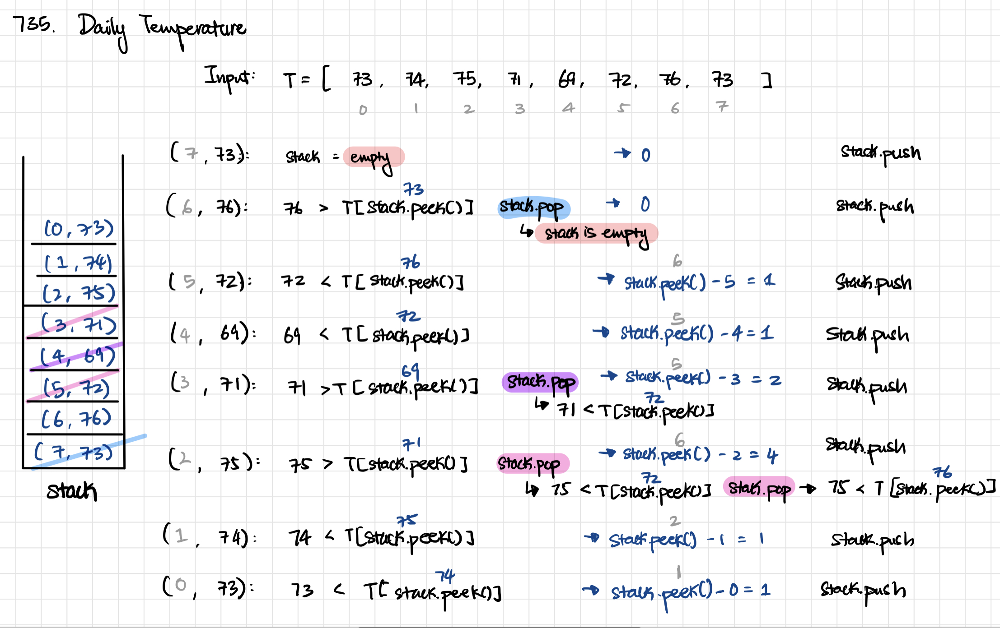

August 5, 2021

### Week 3 - Review

| No. | Problems                                                               | Diff | Day | Previous | Finished |
| --- | ---------------------------------------------------------------------- | ---- | --- | -------- | -------- |
| 1   | [451. Sort Characters By Frequency](#451-Sort-Characters-By-Frequency) | 🟠   | Thu | &check;  | &check;  |
| 2   | [739. Daily Temperatures](#739-Daily-Temperatures)                     | 🟠   | Thu |          | &check;  |
| 3   | [907. Sum of Subarray Minimums](#907-Sum-of-Subarray-Minimums)         | 🟠   | Thu | &check;  |          |
| 4   | [456. 132 Pattern](#456-132-Pattern)                                   | 🟠   | Thu | &check;  |          |
|     |                                                                        |      |     |          |          |
| 1   | [735. Asteroid Collision](#735-Asteroid-Collision)                     | 🟠   | Fri | &check;  | &check;  |
| 2   | [147. Insertion Sort List](#147-Insertion-Sort-List)                   | 🟠   | Fri |          | &check;  |
| 3   | [135. Candy](#135-Candy)                                               | 🔴   | Fri |          |          |
| 4   | [402. Remove K Digits](#402-Remove-K-Digits)                           | 🟠   | Fri | &check;  |          |
| 5   | [560. Subarray Sum Equals K](#560-Subarray-Sum-Equals-K)               | 🟠   | Fri | &check;  |          |

**TODO:**

- 451. Sort Characters By Frequency (Bucket Sort)
- 739. Daily Temperatures (DP)

<br>

## Thursday

### [451. Sort Characters By Frequency](https://leetcode.com/problems/sort-characters-by-frequency/)

Input: `s = "tree"`  
Output: `"eert"`

#### Approach 1: (Hash Table + Sort)

- Use hash table to store the frequency of all unique characters in a string. Then, sort each unique characters in the return string.

  ```java
  // Time: O(n log n)
  // Space: O(n)
  public String frequencySort(String s) {
      HashMap<Character, Integer> freq = new HashMap<>();
      PriorityQueue<Character> pq = new PriorityQueue<>((a,b) -> freq.get(b) - freq.get(a) );

      for (char c: s.toCharArray())
          freq.put(c, freq.getOrDefault(c, 0)+1);

      for (char c: freq.keySet())
          pq.add(c);

      StringBuilder res = new StringBuilder();
      while (!pq.isEmpty()) {
          char c = pq.poll();
          for (int i = 0; i < freq.get(c); i++)
              res.append(c);
      }

      return res.toString();
  }
  ```

#### Approach 2: (Bucket Sort)

<br>

### [739. Daily Temperatures](https://leetcode.com/problems/daily-temperatures/)

Input: temperatures = `[73,74,75,71,69,72,76,73]`  
Output: `[1,1,4,2,1,1,0,0]`

#### Approach 1: (Brute Force)

- Check each element's next warmer day
  ```java
  // Time: O(n^2)
  // Space: O(1)
  public int[] dailyTemperatures(int[] temperatures) {
      int n = temperatures.length;
      int [] answer = new int[n];
      for (int i = 0; i < n-1; i++) {
          for (int j = i+1; j < n; j++) {
              if (temperatures[j] > temperatures[i]) {
                  answer[i] = j-i;
                  break;
              }
          }
      }
      return answer;
  }
  ```

#### Approach 2: (Monotonic Stack)

- Similar to [907. Sum of Subarray Minimums](#907-Sum-of-Subarray-Minimums)
- Monotonic Stack that keeps decreasing elements from bottom to top

  - 

  ```java
  // Time: O(n)
  // Space: O(n)
  public int[] dailyTemperatures(int[] temperatures) {
      int n = temperatures.length;
      int [] ans = new int[n];

      Deque<Integer> maxStack = new ArrayDeque<>(); // keep a decreasing stack from bottom to top
      // Stack<Integer> maxStack = new Stack<>();
      for (int i = n-1; i >= 0; i--) {
          while (!maxStack.isEmpty() && temperatures[maxStack.peekFirst()] <= temperatures[i])
              maxStack.pollFirst();
          ans[i] = maxStack.isEmpty() ? 0:maxStack.peekFirst()-i;
          maxStack.push(i);
      }
      return ans;
  }
  ```

#### Approach 3: (Dynamic Programming)

- Use extra dp array to store all the next warmer day difference
  ```java
   // Time: O(n)
   // Space: O(n)
   public int[] dailyTemperatures(int[] temperatures) {
        int n = temperatures.length;
        int [] ans = new int[n];
        for (int i = n-1; i >= 0; i--) {
            int j = i+1;
            while (j < n) {
                if (temperatures[j] > temperatures[i])  {
                    ans[i] = j-i;
                    break;
                }
                // if current range(i, n) is decreasing, there is no warmer temp than temp[i]
                else if (ans[j] == 0)
                    break;
                // it implies that temp[j] <= temp[i] and temp[j] had been taken care,
                // so the number larger than temp[j] must be temp[ans[j]]
                else
                    j += ans[j];
            }
        }
        return ans;
    }
  ```

<br>

### [907. Sum of Subarray Minimums](https://leetcode.com/problems/sum-of-subarray-minimums/)

<br>

### [456. 132 Pattern](https://leetcode.com/problems/132-pattern/)

<br>
<br>

## Friday

### [735. Asteroid Collision](https://leetcode.com/problems/asteroid-collision/)

Input: asteroids = `[5,10,-5]`  
Output: `[5,10]`

#### Approach

- (A, B) represents each pair in the given array

  - Case 1: A(pos) is to the right and B(neg) is to the left (collision happened)
  - Case 2: A(neg) is to the left and B(pos) is to the right (no collision happened)
  - Case 3 & 4: A(pos) and B(pos), or A(neg) and B(neg), since they're towards the same direction (no collision)

- Based on the 4 cases, only consider the collision case:

  - \*Always add the positives to the stack, all leftover of the stack will be the remaining asteroids
  - if two asteroids collides, A is from the top of stack and B is the current asteroid
    - Case 1 (A < B or B < A) : the smaller one will explode
    - Case 2 (A == B): both explode

  ```java
  // Time: O(n)
  // Space: O(n)
  public int[] asteroidCollision(int[] asteroids) {
      Stack<Integer> stack = new Stack<Integer>();

      for (int current: asteroids) {
          boolean collided = false;

          // if A(left) has positive asteroids and B(right) is negative (collision occurred)
          while (!stack.isEmpty() && current < 0 && stack.peek() > 0 && !collided) {

              // abs(B) > abs(A), remove smaller asteroid
              if (stack.peek() < -current) {
                  stack.pop();
                  continue; // check all of the left side (elements in stack) until no collisions
              }
              // abs(B) == abs(A), remove both (do not add right and remove left)
              else if (stack.peek() == -current) {
                  stack.pop();
                  collided = true;
              }
              // abs(B) < abs(A), do not add right and move on to other new asteroids
              else
                  collided = true;
          }

          if (!collided)
              stack.add(current);
      }

      // Convert stack to array
      int[] ans = new int[stack.size()];
      for (int t = ans.length - 1; t >= 0; --t) {
          ans[t] = stack.pop();
      }

      return ans;
  }
  ```

<br>

### [147. Insertion Sort List](https://leetcode.com/problems/insertion-sort-list/)

Input: head = `[4,2,1,3]`  
Output: `[1,2,3,4]`

#### Approach

- Use dummy pointer, prev pointer, and curr pointer to do the insertion of each node

  ```java
  // Time: O(n^2)
  // Space: O(1)
  public ListNode insertionSortList(ListNode head) {
      ListNode dummy = new ListNode();
      ListNode curr = head;

      while (curr != null) {
          ListNode prev = dummy;

          // Repeat until find the place to insert the current node to the front
          while (prev.next != null && prev.next.val < curr.val) {
              prev = prev.next;
          }
          // Remember the position of unsorted node
          ListNode next = curr.next;

          // Insert to the front
          curr.next = prev.next;

          // Next unsorted node
          prev.next = curr;

          curr = next;
      }

      return dummy.next;
  }
  ```

<br>

### [135. Candy](https://leetcode.com/problems/candy/)

#### Approach

- Explanation, ideas
  ```java
    // code
  ```

<br>

### [402. Remove K Digits](https://leetcode.com/problems/remove-k-digits/description/)

#### Approach

- Explanation, ideas
  ```java
    // code
  ```

<br>

### [560. Subarray Sum Equals K](https://leetcode.com/problems/subarray-sum-equals-k/)

#### Approach

- Explanation, ideas
  ```java
    // code
  ```

<br>
