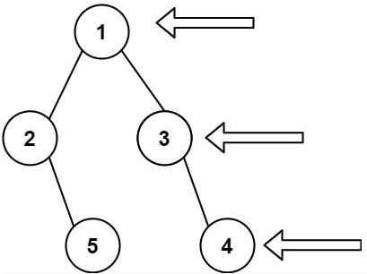

August 9, 2021

### Week 4 - Binary Tree

| No. | Problems                                                                                           | Diff | Day | Previous | Finished |
| --- | -------------------------------------------------------------------------------------------------- | ---- | --- | -------- | -------- |
| 1   | [230. Kth Smallest Element in a BST](#230-Kth-Smallest-Element-in-a-BST)                           | 🟠   | Mon |          | &check;  |
| 2   | [**98. Validate Binary Search Tree**](#98-Validate-Binary-Search-Tree)                             | 🟠   | Mon | &check;  | &check;  |
| 3   | [**110. Balanced Binary Tree**](#110-Balanced-Binary-Tree)                                         | 🟢   | Mon | &check;  | &check;  |
| 4   | [**101. Symmetric Tree**](#101-Symmetric-Tree)                                                     | 🟢   | Mon |          | &check;  |
| 5   | [102. Binary Tree Level Order Traversal](#102-Binary-Tree-Level-Order-Traversal)                   | 🟠   | Mon |          | &check;  |
|     |                                                                                                    |      |     |          |          |
| 6   | [107. Binary Tree Level Order Traversal II](#107-Binary-Tree-Level-Order-Traversal-II)             | 🟠   | Tue |          | &check;  |
| 7   | [**814. Binary Tree Pruning**](#814-Binary-Tree-Pruning)                                           | 🟠   | Tue |          | &check;  |
| 8   | [111. Minimum Depth of Binary Tree](#111-Minimum-Depth-of-Binary-Tree)                             | 🟢   | Tue |          | &check;  |
| 9   | [226. Invert Binary Tree](#226-Invert-Binary-Tree)                                                 | 🟢   | Tue | &check;  | &check;  |
| 10  | [199. Binary Tree Right Side View](#199-Binary-Tree-Right-Side-View)                               | 🟠   | Tue | &check;  | &check;  |
|     |                                                                                                    |      |     |          |          |
| 11  | [652. Find Duplicate Subtrees](#652-Find-Duplicate-Subtrees)                                       | 🟠   | Wed |          | &check;  |
| 12  | [**508. Most Frequent Subtree Sum**](#508-Most-Frequent-Subtree-Sum)                               | 🟠   | Wed |          | &check;  |
| 13  | [112. Path Sum](#112-Path-Sum)                                                                     | 🟢   | Wed |          | &check;  |
| 14  | [**113. Path Sum II**](#113-Path-Sum-II)                                                           | 🟠   | Wed | &check;  |          |
| 15  | [1448. Count Good Nodes in Binary Tree](#1448-Count-Good-Nodes-in-Binary-Tree)                     | 🟠   | Wed |          |          |
|     |                                                                                                    |      |     |          |          |
| 16  | [114. Flatten Binary Tree to Linked List](#114-Flatten-Binary-Tree-to-Linked-List)                 | 🟠   | Thu |          | &check;  |
| 17  | [173. Binary Search Tree Iterator](#173-Binary-Search-Tree-Iterator)                               | 🟠   | Thu |          | &check;  |
| 18  | [515. Find Largest Value in Each Tree Row](#515-Find-Largest-Value-in-Each-Tree-Row)               | 🟠   | Thu | &check;  |          |
| 19  | [108. Convert Sorted Array to Binary Search Tree](#108-Convert-Sorted-Array-to-Binary-Search-Tree) | 🟢   | Thu |          |          |
| 20  | [938. Range Sum of BST](#938-Range-Sum-of-BST)                                                     | 🟢   | Thu | &check;  | &check;  |
|     |                                                                                                    |      |     |          |          |
| 21  | [449. Serialize and Deserialize BST](#449-Serialize-and-Deserialize-BST)                           | 🟠   | Fri |          |          |
| 22  | [297. Serialize and Deserialize Binary Tree](#297-Serialize-and-Deserialize-Binary-Tree)           | 🔴   | Fri |          |          |
| 23  | [617. Merge Two Binary Trees](#617-Merge-Two-Binary-Trees)                                         | 🟢   | Fri |          |          |
| 24  | [572. Subtree of Another Tree](#572-Subtree-of-Another-Tree)                                       | 🟢   | Fri | &check;  |          |
| 25  | [543. Diameter of Binary Tree](#543-Diameter-of-Binary-Tree)                                       | 🟢   | Fri | &check;  |          |

**TODO:**

- **98. Validate Binary Search Tree**
- **110. Balanced Binary Tree**
- **101. Symmetric Tree**
- 107. Binary Tree Level Order Traversal II (Recursion)
- **814. Binary Tree Pruning**
- **508. Most Frequent Subtree Sum**
- **113. Path Sum II**
- 114. Flatten Binary Tree to Linked List (Recursion)
- 173. Binary Search Tree Iterator (Controlled Recursion)
- 617. Merge Two Binary Trees

<br>

## Monday

### [230. Kth Smallest Element in a BST](https://leetcode.com/problems/kth-smallest-element-in-a-bst/)

Given the `root` of a binary search tree, and an integer k, return the `kth (1-indexed)` smallest element in the tree.

#### Approach 1: (Priority Queue)

- Inorder to find the Kth smallest element, traverse the whole tree and put every node's value into a priority queue

  ```java
  // Time: O(n log n)
  // Space: O(n)
  class Solution {
      private Queue<Integer> queue = new PriorityQueue<>();

      public int kthSmallest(TreeNode root, int k) {
          traverse(root);
          return getKth(k);
      }

      private void traverse(TreeNode root) {
          if (root == null) return;
          queue.add(root.val);
          traverse(root.left);
          traverse(root.right);
      }

      private int getKth(int k) {
          while (k-- > 1 && !queue.isEmpty())
              queue.poll();
          return queue.isEmpty()? -1:queue.poll();
      }
  }
  ```

#### Approach 2:

- The inorder traversal of a BST is in sorted increasing order
  ```java
  // Time: O(n)
  // Space: O(n)
  class Solution {
      private ArrayList<Integer> list = new ArrayList<Integer>();
      public int kthSmallest(TreeNode root, int k) {
          traverse(root);
          return list.get(k-1);
      }
      // inorder traverseal of a BST is sorted
      private void traverse(TreeNode root) {
          if (root == null)
              return;
          traverse(root.left);
          list.add(root.val);
          traverse(root.right);
      }
  }
  ```

<br>

### [98. Validate Binary Search Tree](https://leetcode.com/problems/validate-binary-search-tree/)

A valid BST is defined as follows:

- The left subtree of a node contains only nodes with keys less than the node's key.
- The right subtree of a node contains only nodes with keys greater than the node's key.
- Both the left and right subtrees must also be binary search trees.

Input: root = `[2,1,3]`  
Output: `true`

#### Approach:

- For every node, the left has to be less than all of its upper nodes, and all right has to be greater than all of the upper nodes.

  ```java
  // Time: O(n)
  // Space: O(n) for recursion stack
  public boolean isValidBST(TreeNode root) {
      return validate(root, null, null);
  }

  public boolean validate(TreeNode root, Integer low, Integer high) {
      if (root == null)
          return true;
      if ( (low != null && low >= root.val) || (high != null && high <= root.val) )
          return false;
      return validate(root.left, low, root.val) && validate(root.right, root.val, high);
  }
  ```

<br>

### [110. Balanced Binary Tree](https://leetcode.com/problems/balanced-binary-tree/)

Height-balanced binary tree is defined as:

- a binary tree in which the left and right subtrees of every node differ in height by no more than 1.

Input: root = `[3,9,20,null,null,15,7]`  
Output: `true`

#### Approach:

- TO BE ADDED

  ```java
  public boolean isBalanced(TreeNode root) {
      if (root == null) return true;
      return Math.abs(height(root.left) - height(root.right)) <= 1 && isBalanced(root.left) && isBalanced(root.right);
  }

  private int height(TreeNode root) {
      if (root == null)
          return 0;
      return 1 + Math.max(height(root.left), height(root.right));
  }
  ```

<br>

### [101. Symmetric Tree](https://leetcode.com/problems/symmetric-tree/)

Given the `root` of a binary tree, check whether it is a mirror of itself (i.e., symmetric around its center).

#### Approach 1: (Iterative)

- TO BE ADDED

  ```java
  // Time: O(n)
  // Space: O(n)
  public boolean isSymmetric(TreeNode root) {
      Queue<TreeNode> queue = new LinkedList<>();
      queue.add(root);
      queue.add(root);
      while (!queue.isEmpty()) {
          TreeNode left = queue.poll();
          TreeNode right = queue.poll();

          if (left == null && right == null) continue;
          if (left == null || right == null) return false;
          if (left.val != right.val) return false;

          queue.add(left.left);
          queue.add(right.right);
          queue.add(left.right);
          queue.add(right.left);
      }
      return true;
  }
  ```

#### Approach 2: (Recursion)

- TO BE ADDED

  ```java
  // Time: O(n)
  // Space: O(n)
  public boolean isSymmetric(TreeNode root) {
      return isMirror(root, root);
  }
  public boolean isMirror(TreeNode t1, TreeNode t2) {
      if (t1 == null && t2 == null) return true;
      if (t1 == null || t2 == null) return false;
      return (t1.val == t2.val)
          && isMirror(t1.right, t2.left)
          && isMirror(t1.left, t2.right);
  }
  ```

<br>

### [102. Binary Tree Level Order Traversal](https://leetcode.com/problems/binary-tree-level-order-traversal/)

Given the root of a binary tree, return the level order traversal of its nodes' values. (i.e., from left to right, level by level).



Input: root = `[3,9,20,null,null,15,7]`
Output: `[[3],[9,20],[15,7]]`

#### Approach:

- Level order is BFS, every level is saved to the temporary queue. Before getting to the children of the nodes in queue, record all parent node value of current level.

  ```java
  // Time: O(n)
  // Space: O(n)
  public List<List<Integer>> levelOrder(TreeNode root) {
      List<List<Integer>> res = new ArrayList<List<Integer>>();
      if (root == null) return res;
      Queue<TreeNode> queue = new LinkedList<>();
      queue.add(root);

      while (!queue.isEmpty()) {
          int n = queue.size();
          List<Integer> level = new ArrayList<>();
          TreeNode curr = null;
          while (n-- > 0) {
              curr = queue.poll();
              level.add(curr.val);
              if (curr.left != null) queue.add(curr.left);
              if (curr.right != null)  queue.add(curr.right);
          }
          res.add(level);
      }
      return res;
  }
  ```

<br>
<br>

## Tuesday

### [107. Binary Tree Level Order Traversal II(https://leetcode.com/problems/binary-tree-level-order-traversal-ii/)

Given the `root` of a binary tree, return the **bottom-up** level order traversal of its nodes' values. (i.e., from left to right, level by level from leaf to root).

Input: root = `[3,9,20,null,null,15,7]`
Output: `[[3],[9,20],[15,7]]`

#### Approach 1: (BFS iterative)

- Same idea from the previous problem, but in reverse order for levels. Then, just insert to front for every level. Or reverse the return list at the end.

  ```java
  // Time: O(n)
  // Space: O(n)
  public List<List<Integer>> levelOrder(TreeNode root) {
      List<List<Integer>> res = new ArrayList<List<Integer>>();
      if (root == null) return res;
      Queue<TreeNode> queue = new LinkedList<>();
      queue.add(root);

      while (!queue.isEmpty()) {
          int n = queue.size();
          List<Integer> level = new ArrayList<>();
          TreeNode curr = null;
          while (n-- > 0) {
              curr = queue.poll();
              level.add(curr.val);
              if (curr.left != null) queue.add(curr.left);
              if (curr.right != null)  queue.add(curr.right);
          }
          res.add(0, level);
      }
      return res;
  }
  ```

#### Approach 2: (Recursion)

- TO BE ADDED

<br>

### [814. Binary Tree Pruning](https://leetcode.com/problems/binary-tree-pruning/)

#### Approach:

<br>

### [111. Minimum Depth of Binary Tree](https://leetcode.com/problems/minimum-depth-of-binary-tree/)

Given a binary tree, find its minimum depth.  
The minimum depth is the number of nodes along the shortest path from the root node down to the nearest leaf node.  
Note: A leaf is a node with no children.

#### Approach:

- DFS with queue to do level order traversal

  ```java
  // Time: O(n)
  // Space: O(n)
  public int minDepth(TreeNode root) {
      int depth = 0;
      if (root == null)  return depth;

      Queue<TreeNode> queue = new LinkedList<>();
      queue.add(root);

      while (!queue.isEmpty()) {
          depth++;
          int n = queue.size();
          while (n-- > 0) {
              root = queue.poll();
              if (root.left == null && root.right == null)
                  return depth;
              if (root.left != null) queue.add(root.left);
              if (root.right != null) queue.add(root.right);
          }
      }

      return depth;
  }
  ```

<br>

### [226. Invert Binary Tree](https://leetcode.com/problems/invert-binary-tree/)

Input: root = `[4,2,7,1,3,6,9]`  
Output: `[4,7,2,9,6,3,1]`

#### Approach:

- Swap all left child with right child

  ```java
  // Time: O(n)
  // Space:O(n)
  public TreeNode invertTree(TreeNode root) {
      invert(root);
      return root;
  }

  private void invert(TreeNode root) {
      if (root == null)
          return;
      TreeNode temp = root.left;
      root.left = root.right;
      root.right = temp;
      invert(root.left);
      invert(root.right);
  }
  ```

<br>

### [199. Binary Tree Right Side View](https://leetcode.com/problems/binary-tree-right-side-view/)

Input: root = `[1,2,3,null,5,null,4]`
Output: `[1,3,4]`

#### Approach

- Same idea for level order traversal problem, use BFS to traverse the tree. The node on the level's rightmost is node to be added to return list.

  ```java
  // Time: O(n)
  // Space: O(n)
  public List<Integer> rightSideView(TreeNode root) {
      List<Integer> right = new ArrayList<>();
      if (root == null) return right;

      Queue<TreeNode> queue = new LinkedList<>();
      queue.add(root);

      while (!queue.isEmpty()) {
          int n = queue.size();
          while (n-- > 0) {
              root = queue.poll();
              if (root.left != null) queue.add(root.left);
              if (root.right!= null) queue.add(root.right);
          }
          right.add(root.val);
      }

      return right;
  }
  ```

  <br>

<br>

## Wednesday

### [652. Find Duplicate Subtrees](https://leetcode.com/problems/find-duplicate-subtrees/)

#### Approach:

<br>

### [508. Most Frequent Subtree Sum](https://leetcode.com/problems/most-frequent-subtree-sum/)

#### Approach

- TO BE ADDED

<br>

### [112. Path Sum](https://leetcode.com/problems/path-sum/)

Given the root of a binary tree and an integer targetSum, return true if the tree has a **root-to-leaf** path such that adding up all the values along the path equals targetSum.

#### Approach:

- Recursive calls to see if there's a path is targetSum from root to leaf.
- A leaf node is defined as no left child nor right child, so when we meet a leaf node, check for the sum == 0
  ```java
  // Time: O(n)
  // Space: O(n)
  public boolean hasPathSum(TreeNode root, int targetSum) {
      if (root == null)
          return false;
      targetSum -= root.val;
      if (root.left == null && root.right == null)
          return targetSum == 0;
      return hasPathSum(root.left, targetSum) || hasPathSum(root.right, targetSum);
  }
  ```

<br>

### [113. Path Sum II](https://leetcode.com/problems/path-sum-ii/)

#### Approach:

<br>

### [1448. Count Good Nodes in Binary Tree](https://leetcode.com/problems/count-good-nodes-in-binary-tree/)

<br>
<br>

## Thursday

### [114. Flatten Binary Tree to Linked List](https://leetcode.com/problems/flatten-binary-tree-to-linked-list/)

Input: root = `[1,2,5,3,4,null,6]`  
Output: `[1,null,2,null,3,null,4,null,5,null,6]`

#### Approach 1: (Iterative)

- BFS and have all nodes on the right
  ```java
  public void flattenDFS(TreeNode root) {
      if (root == null) return;
      Deque<TreeNode> stack = new ArrayDeque<>();
      stack.addLast(root);
      while (!stack.isEmpty()) {
          root = stack.pollLast();
          if (root.right != null) stack.addLast(root.right);
          if (root.left != null) stack.addLast(root.left);
          if (!stack.isEmpty())
              root.right = stack.peekLast();
          root.left = null;
      }
  }
  ```

#### Approach 2: (Recursion)

<br>

### [173. Binary Search Tree Iterator](https://leetcode.com/problems/binary-search-tree-iterator/)

Input:

```
["BSTIterator", "next", "next", "hasNext", "next", "hasNext", "next", "hasNext", "next", "hasNext"]
[[[7, 3, 15, null, null, 9, 20]], [], [], [], [], [], [], [], [], []]
```

Output:
`[null, 3, 7, true, 9, true, 15, true, 20, false]`

#### Approach 1: (Flatten)

- Return every current minimum value in the tree, flatten the tree in a sorted list

  ```java
  class BSTIterator {
      int curr;
      ArrayList<Integer> sortedList;

      public BSTIterator(TreeNode root) {
          sortedList = new ArrayList<>();
          curr = -1;
          inorder(root);
          // System.out.println(sortedList.toString());
      }

      private void inorder(TreeNode root) {
          if (root == null)
              return;
          inorder(root.left);
          sortedList.add(root.val);
          inorder(root.right);
      }

      public int next() {
          return sortedList.get(++curr);
      }

      public boolean hasNext() {
          return curr+1 < sortedList.size();
      }
  }
  ```

#### Approach 2: (Controlled Recursion)

<br>

### [515. Find Largest Value in Each Tree Row](https://leetcode.com/problems/find-largest-value-in-each-tree-row/)

Input: root = `[1,3,2,5,3,null,9]`  
Output: `[1,3,9]`

#### Approach:

- BFS with queue to perform order level traversal

  ```java
  // Time: O(n)
  // Space: O(n)
  public List<Integer> largestValues(TreeNode root) {
      List<Integer> ans = new ArrayList<>();

      if (root == null) return ans;

      Queue<TreeNode> queue = new LinkedList<>();
      queue.add(root);

      while (!queue.isEmpty()) {
          int n = queue.size();

          int max = queue.peek().val;
          while (n-- > 0) {
              root = queue.poll();
              max = Math.max(root.val, max);

              if (root.left != null) queue.add(root.left);
              if (root.right != null) queue.add(root.right);
          }
          ans.add(max);
      }

      return ans;
  }
  ```

<br>

### [108. Convert Sorted Array to Binary Search Tree](https://leetcode.com/problems/convert-sorted-array-to-binary-search-tree/)

#### Approach:

<br>

### [938. Range Sum of BST](https://leetcode.com/problems/range-sum-of-bst/)

Input: root = `[10,5,15,3,7,null,18]`, low = `7`, high = `15`  
Output: 32

#### Approach:

- Since it's a BST,
  - if current node is greater than `low`, then the range sum must be found in its left subtree.
  - if current node is less than `high`, then the range sum must be found in its right subtree.
  - if current node falls in the range, add to `ans` and the range might be found in left or and right subtrees
  ```java
  // Time: O(n)
  // Space: O(n)
  private int ans = 0;
  public int rangeSumBST(TreeNode root, int low, int high) {
      if (root == null)
          return 0;
      if (root.val >= low && root.val <= high)
          ans += root.val;
      if (root.val > low)
          rangeSumBST(root.left, low, high);
      if (root.val < high)
          rangeSumBST(root.right, low, high);
      return ans;
  }
  ```

<br>
<br>

## Friday

### [449. Serialize and Deserialize BST](https://leetcode.com/problems/serialize-and-deserialize-bst/)

Question

#### Approach

- Explanation, ideas
  ```java
    // code
  ```

<br>

### [297. Serialize and Deserialize Binary Tree](https://leetcode.com/problems/serialize-and-deserialize-binary-tree/)

#### Approach:

<br>

### [617. Merge Two Binary Trees](https://leetcode.com/problems/merge-two-binary-trees/)

Input: root1 = `[1,3,2,5]`, root2 = `[2,1,3,null,4,null,7]`  
Output: [3,4,5,5,4,null,7]

#### Approach:

- TO BE ADDED

  ```java
  // Time: O(n)
  // Space: O(n)
  public TreeNode mergeTrees(TreeNode root1, TreeNode root2) {
      if (root1 == null)
          return root2;
      if (root2 == null)
          return root1;

      root1.val += root2.val;
      root1.left = mergeTrees(root1.left, root2.left);
      root1.right = mergeTrees(root1.right, root2.right);
      return root1;
  }
  ```

<br>

### [572. Subtree of Another Tree](https://leetcode.com/problems/subtree-of-another-tree/)

#### Approach:

<br>

### [543. Diameter of Binary Tree](https://leetcode.com/problems/diameter-of-binary-tree/)

#### Approach:

<br>
````
