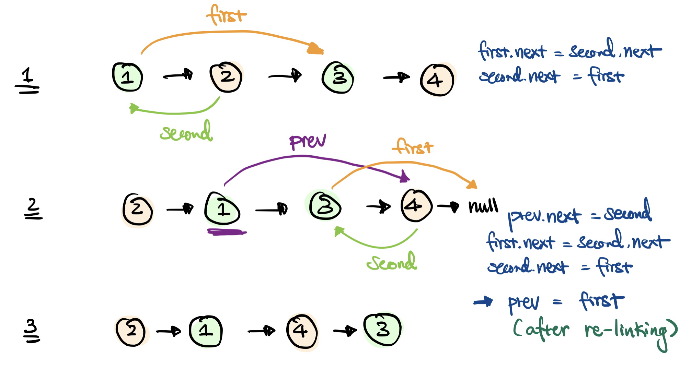
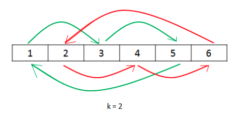
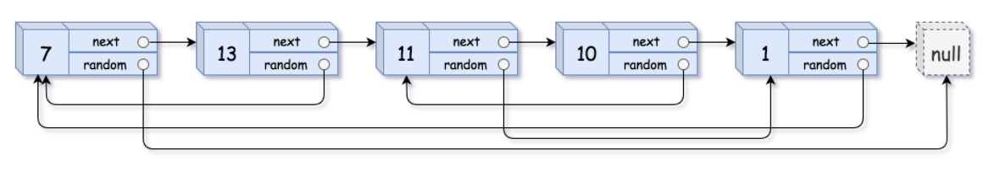

July 26, 2021

### Week 2 - Linked List

| No. | Problems                                                                               | Diff | Day | Previous | Finished |
| --- | -------------------------------------------------------------------------------------- | ---- | --- | -------- | -------- |
| 1   | [24. Swap Nodes in Pairs](#24-Swap-Nodes-In-Pairs)                                     | 🟠   | Mon | &check;  | &check;  |
| 2   | [61. Rotate List](#61-Rotate-List)                                                     | 🟠   | Mon |          | &check;  |
| 3   | [21. Merge Two Sorted Lists](#21-Merge-Two-Sorted-Lists)                               | 🟢   | Mon | &check;  | &check;  |
| 4   | [160. Intersection of Two Linked Lists](#160-Intersection-Of-Two-Linked-Lists)         | 🟢   | Mon | &check;  | &check;  |
| 5   | [189. Rotate Array](#189-Rotate-Array)                                                 | 🟠   | Mon |          | &check;  |
|     |                                                                                        |      |     |          |          |
| 1   | [445. Add Two Numbers II](#445-Add-Two-Numbers-II)                                     | 🟠   | Tue | &check;  | &check;  |
| 2   | [138. Copy List with Random Pointer](#138-Copy-List-with-Random-Pointer)               | 🟠   | Tue | &check;  | &check;  |
| 3   | [15. 3Sum](#15-3Sum)                                                                   | 🟠   | Tue |          |          |
| 4   | [287. Find Duplicate Number](#287-Find-Duplicate-Number)                               | 🟠   | Tue |          |          |
| 5   | [142. Linked List Cycle II](#142-Linked-List-Cycle-II)                                 | 🟠   | Tue |          |          |
|     |                                                                                        |      |     |          |          |
| 1   | [143. Reorder List](#143-Reorder-List)                                                 | 🟠   | Wed |          | &check;  |
| 2   | [23. Merge k Sorted Lists](#23-Merge-k-Sorted-Lists)                                   | 🔴   | Wed |          | &check;  |
| 3   | [83. Remove Duplicates from Sorted List](#83-Remove-Duplicates-from-Sorted-List)       | 🟢   | Wed |          | &check;  |
| 4   | [82. Remove Duplicates from Sorted List II](#82-Remove-Duplicates-from-Sorted-List-II) | 🟠   | Wed |          |          |
| 5   | [706. Design HashMap](#706-Design-HashMap)                                             | 🟢   | Wed | &check;  |          |

<br>

## Monday

### [24. Swap Nodes in Pairs](https://leetcode.com/problems/swap-nodes-in-pairs/)

Given a linked list, swap every two adjacent nodes and return its head. You must solve the problem without modifying the values in the list's nodes (i.e., only nodes themselves may be changed.)

Input: `1 -> 2 -> 3 -> 4`  
Output: `2 -> 1 -> 4 -> 3`

#### Approach:

- Dealing with two nodes at a time, keep track of a first and second pointer and also a prev pointer to link every pairs  
  

```java
// Time: O(n)
// Space: O(1)
public ListNode swapPairs(ListNode head) {
    ListNode res = new ListNode(0); // for returning the new head
    res.next = head;
    ListNode prev = res;

    while (head != null && head.next != null) {

        ListNode first = head;
        ListNode second = head.next;

        prev.next = second;
        first.next = second.next;
        second.next = first;

        prev = first;
        head = first.next;
    }
    return res.next;
}
```

<br>

### [61. Rotate List](https://leetcode.com/problems/rotate-list/)

Given the head of a linked list, rotate the list to the right by `k` places.

Input: `1 -> 2 -> 3 -> 4 -> 5`, `k = 2`  
Output: `4 -> 5 -> 1 -> 2 -> 3`

Input: `0 -> 1 -> 2`, `k = 4`  
Output: `2 -> 0 -> 1`

#### Approach:

- Based on the examples, it's uncessary to perform actual rotations to the list which would result in `k*n` iterations.
- Thus, simply use n - number of nodes and k - number of iterations to calculate where to split the list and link two partitioned lists together.

  - Intuition:

  1. `n == k` or `k%n == 0`: no rotation needed, return original
  2. `n < k`: `n - (k%n)`
  3. `n > k`: `n - k`

  These three cases can be combined as `n-(k%n)`, but keep the first case to avoid unncessary iterations of the list.

  ```java
  // Time: O(n), exact = O(n + (k%n))
  // Space: O(1)
  public ListNode rotateRight(ListNode head, int k) {
      // If n <= 1, then NO Rotation needed
      if(head == null || head.next == null) return head;

      ListNode curr = head;
      int n = 1;

      // keep track of the tail node for later linking to the head
      while (curr.next != null) {
          n++;
          curr = curr.next;
      }

      // If k%n == 0, then NO Rotation needed
      if (k%n != 0) {
          n -= k%n; // gives the location of partition

          ListNode tail = curr;
          curr = head;

          // leaves one node before in order to do linking
          while (n > 1) {
              n--;
              curr = curr.next;
          }

          tail.next = head; // links the tail and head, now it creates a cycle
          head = curr.next; // mark the head of the new rotated list
          curr.next = null; // now, break the cycle by assigning the new tail node to point at null
      }
      return head;
  }
  ```

<br>

### [21. Merge Two Sorted Lists](https://leetcode.com/problems/merge-two-sorted-lists/)

Merge two sorted linked lists and return it as a `sorted list`. The list should be made by splicing together the nodes of the first two lists.

#### Approach:

- Use a new head, iterate two list and compare two nodes at a time. Have the new head link to the smallest node. Lastly, when either one list gets to the tail, the assumption is made that the non-empty list is the final part of a merged list, so we can link the rest by having the current node's next pointer pointing to the head of the non-empty list.

  ```java
  // Time: O(n)
  // Space: O(1)
  public ListNode mergeTwoLists(ListNode l1, ListNode l2) {
      ListNode head = new ListNode();
      ListNode curr = head;

      while (l1 != null && l2 != null) {
          if (l1.val < l2.val) {
              curr.next = l1;
              l1 = l1.next;
          } else {
              curr.next = l2;
              l2 = l2.next;
          }
          curr = curr.next;
      }

      curr.next = l1 != null ? l1:l2;

      return head.next;
  }
  ```

<br>

### [160. Intersection of Two Linked Lists](https://leetcode.com/problems/intersection-of-two-linked-lists/)

Given the heads of two singly linked-lists `headA` and `headB`, return the node at which the two lists intersect. If the two linked lists have no intersection at all, return `null`.

Input: `a1 -> a2 -> c1 -> c2 -> c3`  
 `b1 -> b2 -> b3 -> c1 -> c2 -> c3`  
Output: c1, intersection happens after c1

#### Approach 1:

- Use a hash table to store all nodes of one list and check each node of second list. If there is a intersection, it must already in the hash table.

  ```java
  // Time: O(n+m)
  // Space: O(n) stores all nodes from headA
  public ListNode getIntersectionNode(ListNode headA, ListNode headB) {
      Set<ListNode> visited = new HashSet<>();

      while (headA != null) {
          visited.add(headA);
          headA = headA.next;
      }

      if (visited.isEmpty()) return null;

      while (headB != null) {
          if (visited.contains(headB))
              return headB;
          headB = headB.next;
      }

      return null;
  }
  ```

#### Approach 2:

1. same length lists, either has intersection node or not such that list has `x` nodes. Then, listA has to skip `m-x` nodes and listB has to skip `n-x` nodes. Thus, `m-x = n-x when m=n` and only `n iteration` needed.
2. different length list, for two pointers to meet, more passes is needed when two same speed pointers meet.

```java
public ListNode getIntersectionNodeTwoPointer(ListNode headA, ListNode headB) {
        ListNode a = headA, b = headB;
        // int i = 0;
        while (a != b) {
            // System.out.println((++i) + " " + (a == null ? "-" : a.val) + " " + (b == null ? "-" : b.val));
            a = a == null ? headA : a.next;
            b = b == null ? headB : b.next;
        }
        return a;
    }
```

<br>

### [189. Rotate Array](https://leetcode.com/problems/rotate-array/)

Given an array, rotate the array to the right by `k` steps, where `k` is non-negative.

Input: `nums = [1,2,3,4,5,6,7]`, `k = 3`  
Output: `[5,6,7,1,2,3,4]`

#### Approach 1: (Extra Memory)

- Copy original array to an extra array to memorize. Calculate the index of the rotated leftmost element and perform the parition by copying from the memorized array.

  ```java
  // Time: O(n) one pass iteration of overwriting the rotated array
  // Space: O(n) to store the original array
  public void rotate(int[] nums, int k) {
        int n = nums.length;
        if(k%n != 0)  {
            int [] ans = nums.clone();
            for (int i = 0, j = n-(k%n); i < n; i++, j++)
                nums[i] = ans[j < n ? j:j-n];
        }
    }
  ```

#### Approach 2: (Reverse Array)

- Reverse the whole array first, parition the reversed array by `k` and reversed each subarray.

  ```java
  // Time: O(n), one pass to reverse entire array and another pass to reverse two subarray
  // Space: O(1), in place
  public void rotate(int[] nums, int k) {
      int n = nums.length;
      k %= n;
      if(k != 0)  {
          reverse(nums, 0, n-1);
          reverse(nums, 0, k-1);
          reverse(nums, k, n-1);
      }
  }

  public void reverse(int[] nums, int start, int end) {
      while (start < end) {
          int temp = nums[end];
          nums[end] = nums[start];
          nums[start] = temp;

          start++;
          end--;
      }
  }
  ```

#### Approach 3: Using Cyclic Replacements

- Cyclic Replacements  
  

<br>
<br>

## Tuesday

### [445. Add Two Numbers II](https://leetcode.com/problems/add-two-numbers-ii)

Input: `7 -> 2 -> 4 -> 3` (7243)  
 `5 -> 6 -> 4` (564)  
Output: `4 -> 5 -> 1 -> 2 -> 3` (7807)

#### Approach: (Reverse List)

- Similar to [206. Reverse Linked List](https://leetcode.com/problems/reverse-linked-list/) and [2. Add Two Numbers](https://leetcode.com/problems/add-two-numbers/).
- Different than **Add Two Numbers**, the ordering is reversed with the largest digits in front. We can still treat the problem like `No.2` with list reversed.

  ```java
    // Time: O(n+m), one pass for each list, l1, l2 to reverse, and one pass of max(m,n) to to addition
    // Space: O(1),
    public ListNode addTwoNumbers(ListNode l1, ListNode l2) {
        l1 = reverse(l1);
        l2 = reverse(l2);

        ListNode sum = null;
        int carry = 0;

        while (l1 != null || l2 != null) {
            int n = 0, m = 0;

            if (l1 != null) {
                n = l1.val;
                l1 = l1.next;
            }
            if (l2 != null) {
                m = l2.val;
                l2 = l2.next;
            }

            sum = new ListNode((n+m+carry)%10, sum);
            carry = (n+m+carry)/10;
        }

        return carry == 1? new ListNode(carry, sum):sum;
    }

    private ListNode reverse(ListNode head) {
        ListNode next = null;

        while (head != null) {
            ListNode prev = head.next;
            head.next = next;
            next = head;
            head = prev;
        }

        return next;
    }
  ```

<br>

### [138. Copy List with Random Pointer](https://leetcode.com/problems/copy-list-with-random-pointer/)

Construct a deep copy of the list.



Input: head = `[[7,null],[13,0],[11,4],[10,2],[1,0]]`  
Output: `[[7,null],[13,0],[11,4],[10,2],[1,0]]`

#### Approach:

- Copy the list in the respect to the next pointer of each node. Use hashmap to store corresponding node from the two lists for linking the random pointer. Iterate again to identify the random pointer node.

  ```java
  // Time: O(n)
  // Space: O(n), use hashmap to store each node in the original list
  public Node copyRandomList(Node head) {
      HashMap<Node, Node> visited = new HashMap<>();

      Node copied = new Node(-1);
      Node p = copied, curr = head;

      while (curr != null) {
          p.next = new Node(curr.val);
          p = p.next;
          visited.put(curr, p);
          curr = curr.next;
      }

      curr = head;
      p = copied.next;
      while (curr != null) {
          p.random = visited.get(curr.random);
          curr = curr.next;
          p = p.next;
      }

      return copied.next;
  }
  ```

<br>

### [15. 3Sum](https://leetcode.com/problems/3sum/)

<br>

### [287. Find Duplicate Number](https://leetcode.com/problems/find-the-duplicate-number/)

<br>

### [142. Linked List Cycle II](https://leetcode.com/problems/linked-list-cycle-ii/)

<br>
<br>

## Wednesday

### [143. Reorder List](https://leetcode.com/problems/reorder-list/)

Input: `L0 → L1 → … → Ln - 1 → Ln`  
Output: `L0 → Ln → L1 → Ln - 1 → L2 → Ln - 2 → …`  
You may not modify the values in the list's nodes. Only nodes themselves may be changed.

#### Approach 1: (Extra Memory)

- Use an arraylist to store all nodes with one pass. Then, use two pointers to reorder the list from the arraylist. Lastly, the middle node will be reordered as the tail node, its next is null.

  ```java
  // Time: O(n)
  // Space: O(n)
  public void reorderList(ListNode head) {
      ArrayList<ListNode> list = new ArrayList<>();

      ListNode curr = head;
      while (curr != null) {
          list.add(curr);
          curr = curr.next;
      }

      int n = list.size();
      for(int i = 0, j = n-1; i +1 < j; i++, j--) {
          list.get(i).next = list.get(j);
          list.get(j).next = list.get(i+1);
      }

      list.get(n/2).next = null;
  }
  ```

#### Approach 2: (Reverse Second Half)

- Use slow and faster point to locate the middle and reverse the second half of the list. Place each node from two list accordingly.

  ```java
  public void reorderList(ListNode head) {
      ListNode p2 = head, p1 = head;

      while (p1 != null && p1.next != null) {
          p2 = p2.next; // slow pointer
          p1 = p1.next.next; // fast pointer
      }

      p2 = reverse(p2); // reverse the second half
      p1 = head;        // first half

      while (p2.next != null) { // the middle node will be assign to second list's null pointer
          ListNode next = p1.next;
          p1.next = p2;
          p1 = next;

          next = p2.next;
          p2.next = p1;
          p2 = next;
      }
  }

  private ListNode reverse(ListNode curr) {
      ListNode next = null;
      while (curr != null) {
          ListNode prev = curr.next;
          curr.next = next;
          next = curr;
          curr = prev;
      }
      return next;
  }
  ```

<br>

### [23. Merge k Sorted Lists](https://leetcode.com/problems/merge-k-sorted-lists/)

Input: lists = `[[1,4,5],[1,3,4],[2,6]]`  
Output: [1,1,2,3,4,4,5,6]

#### Approach: (Heap/Priority Queue)

- Use a priority queue to store all nodes by its values, and use new head pointer to link all nodes in the priority queue.

  ```java
  // Time: O(n log k) where each node will be sorted with O(log k)
  // Space: O(n)
  public ListNode mergeKLists(ListNode[] lists) {
      // if (lists.length == 0) return null;

      PriorityQueue<ListNode> pq = new PriorityQueue<>((x, y) -> x.val - y.val);

      for (ListNode list: lists) {
          while (list != null) {
              // System.out.println(list.val + " " + (list.next == null ? "null":list.next.val));
              pq.add(list);
              list = list.next;
          }
      }

      ListNode sorted = new ListNode(0);
      ListNode curr = sorted;
      while(!pq.isEmpty()) {
          curr.next = pq.poll();
          curr = curr.next;
      }

      curr.next = null;
      return sorted.next;
  }
  ```

<br>

### [83. Remove Duplicates from Sorted List](https://leetcode.com/problems/remove-duplicates-from-sorted-list/)

Given the head of a sorted linked list, delete all duplicates such that each element appears only once. Return the linked list `**sorted**` as well.

Input: head = `1 -> 1 -> 2`  
Output: `1 -> 2`

#### Approach:

- Iterate through and unlink the duplicated nodes from the list.
  ```java
  // Time: O(n)
  // Space: O(1)
  public ListNode deleteDuplicates(ListNode head) {
      ListNode curr = head;
      while (curr != null && curr.next != null) {
          if (curr.val == curr.next.val)
              curr.next = curr.next.next;
          else
              curr = curr.next;
      }
      return head;
  }
  ```

### [82. Remove Duplicates from Sorted List II](https://leetcode.com/problems/remove-duplicates-from-sorted-list-ii/)

<br>

### [706. Design HashMap](https://leetcode.com/problems/design-hashmap/)

Design a HashMap without using any built-in hash table libraries.

#### Approach:

- Use two arraylists to store the key and values

  ```java
    // O(n) for put, get, and remove;
  class MyHashMap {

      private ArrayList<Integer> ind;
      private ArrayList<Integer> val;

      /** Initialize your data structure here. */
      public MyHashMap() {
          ind = new ArrayList<Integer>();
          val = new ArrayList<Integer>();
      }

      /** value will always be non-negative. */
      public void put(int key, int value) {
          int i = ind.indexOf(key);
          if (i >= 0) {
              val.set(i, value);
          }  else {
              ind.add(key);
              val.add(value);
          }
      }

      /** Returns the value to which the specified key is mapped, or -1 if this map contains no mapping for the key */
      public int get(int key) {
          int i = ind.indexOf(key);
          if(i >= 0)
              return val.get(i);
          return -1;
      }

      /** Removes the mapping of the specified value key if this map contains a mapping for the key */
      public void remove(int key) {
          int i = ind.indexOf(key);
          if (i >= 0) {
              ind.remove(i);
              val.remove(i);
          }
      }
  }

  /**
   * Your MyHashMap object will be instantiated and called as such:
   * MyHashMap obj = new MyHashMap();
   * obj.put(key,value);
   * int param_2 = obj.get(key);
   * obj.remove(key);
   */
  ```
