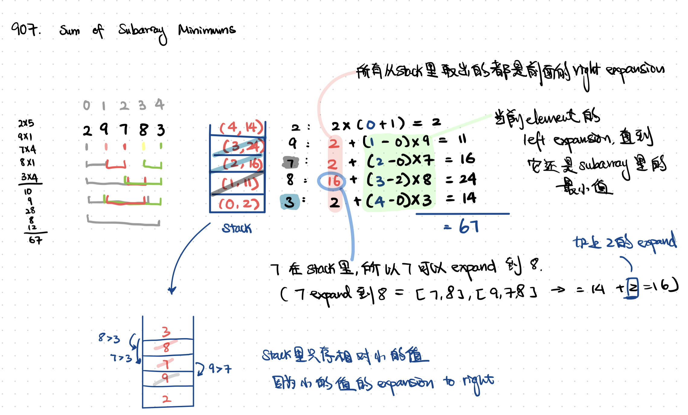

July 31, 2021

## Week 2 - Meeting - Stack

### Mock Interview

1. [456. 132 Pattern](https://leetcode.com/problems/132-pattern/)
2. [402. Remove K Digits](https://leetcode.com/problems/remove-k-digits/)
3. [907. Sum of Subarray Minimums](https://leetcode.com/problems/sum-of-subarray-minimums)

<br>
<br>

### [456. 132 Pattern](https://leetcode.com/problems/132-pattern/)

```java
public boolean find132pattern(int[] nums) {
    int n = nums.length;
    Deque<Integer> d = new ArrayDeque<>();
    int k = Integer.MIN_VALUE;
    for (int i = n - 1; i >= 0; i--) {
        if (nums[i] < k) return true;
        while (!d.isEmpty() && d.peekLast() < nums[i]) {
            k = Math.max(k, d.pollLast());
        }
        d.addLast(nums[i]);
    }
    return false;
}
```

<br>

### [402. Remove K Digits](https://leetcode.com/problems/remove-k-digits/)

```java
public String removeKdigits(String num, int k) {
    Stack<Character> stack = new Stack<Character>();

    for (char c: num.toCharArray()) {
        // only pop the ones that are larger than the next
        if(!stack.isEmpty() && k > 0 && stack.peek() > c) {
            stack.pop();
            k--;
        }
        stack.push(c);
    }

    /* remove the remaining digits from the tail. */
    for(int i=0; i<k; ++i) {
        stack.pop();
    }

    /// build the final string, while removing the leading zeros.
    StringBuilder ret = new StringBuilder();
    boolean leadingZero = true;
    for(char digit: stack) {
        if(leadingZero && digit == '0') continue;
        leadingZero = false;
        ret.append(digit);
    }

    /* return the final string  */
    if (ret.length() == 0) return "0";
    return ret.toString();
}
```

<br>

### [907. Sum of Subarray Minimums](https://leetcode.com/problems/sum-of-subarray-minimums)



```java
public int sumSubarrayMin0s(int[] arr) {
    Stack<Pair<Integer,Integer>> subSum = new Stack<>(); // (index, sum)

    long ans = 0;
    for (int i = 0; i < arr.length; i++) {
        while (!subSum.isEmpty() && arr[subSum.peek().getKey()] > arr[i])
            subSum.pop();

        int sum = subSum.isEmpty() ?
            arr[i] * (i+1) : subSum.peek().getValue() + (i-subSum.peek().getKey()) * arr[i];
        subSum.push(new Pair(i, sum));
        ans += sum;
    }

    return (int) (ans % (long) (1e9 + 7));
}
```
