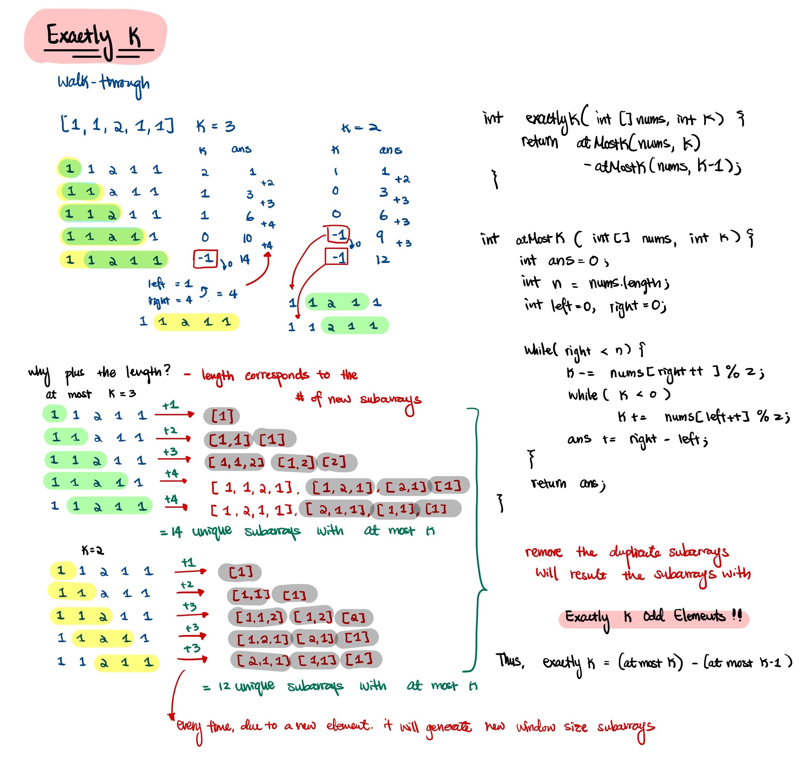

# [1248. Count Number of Nice Subarrays](https://leetcode.com/problems/count-number-of-nice-subarrays/)

Level: 

Topic:    

Similar Problem:

- [992. Subarrays with K Different Integers](0992.md)

## Question

> Given an array of integers nums and an integer k. A continuous subarray is called nice if there are k odd numbers on it.

Input: nums = \[1,1,2,1,1], k = 3\
Output: 2\
Explanation: The only sub-arrays with 3 odd numbers are \[1,1,2,1] and \[1,2,1,1].

## Intuition

Approach 1: (Exactly K)


Approach 2:

- Use `count` to count the number of even integers

## Code

**Time:** O(n)\
**Space:** O(1)

```java
public int numberOfSubarrays(int[] nums, int k) {

    // at most k and at most k - 1 will have duplicates
    // so remove all duplicates will result in exactly k
    return atMost(nums, k) - atMost(nums, k - 1);
}

public int atMost(int[] nums, int k) {
    int ans = 0;
    int left = 0, right = 0;

    while (right < nums.length) {
        k -= nums[right] % 2;
        right++;

        while (k < 0)
            k += nums[left++] % 2;

        // right - left = new window size that generates new sets of subarrays
        ans += right - left;
    }

    return ans;
}
```

Count the even integers

```java
public int numberOfSubarrays(int[] nums, int k) {
    int res = 0;
    int left = 0, right = 0;
    int count = 0; // count is to include the even integers

    while (right < nums.length) {
        int n = nums[right++];
        if (n % 2 == 1) {
            k--;
            count = 0;
        }

        while (k == 0) {
            k += nums[left++] %2;
            count++;
        }
        res += count;
    }

    return res;
}
```
